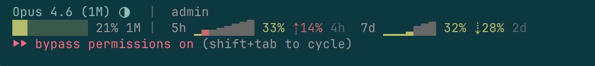

# Claude Pace Sparklines

A statusline for Claude Code with pace tracking and sparkline usage graphs. Single Bash file, zero npm. Only requires `jq`.



## What It Shows

Most statuslines show "you used 60%." That number means nothing without context — 60% with 30 minutes left is fine, but 60% with 4 hours left means you're about to hit the wall. Claude Pace compares your usage rate to the time remaining and shows the delta.

**Line 1:** model, effort indicator (●/◑/◔), context window bar, project (branch), git diff stats

**Line 2:** 5h and 7d usage windows, each with:

- **Sparkline graph** (▁▂▃▄▅▆▇█) — past slots colored green (under pace) or red (over pace), future slots show the pace reference line in dark gray
- **Used %** — current usage in the window
- **Pace delta** — **⇣15%** green = 15% under pace, headroom; **⇡15%** red = 15% over pace, slow down
- **Countdown** — time until the window resets

## Install

Requires `jq` (`brew install jq` on macOS, `apt install jq` on Linux).

```bash
curl -fsSL -o ~/.claude/statusline.sh \
  https://raw.githubusercontent.com/mairas/claude-pace-sparklines/main/claude-pace-sparklines.sh
chmod +x ~/.claude/statusline.sh
```

Add to `~/.claude/settings.json`:

```json
{
  "statusLine": {
    "type": "command",
    "command": "~/.claude/statusline.sh"
  }
}
```

Restart Claude Code. Done.

To upgrade, re-run the `curl` command. To remove, delete the `statusLine` block from `~/.claude/settings.json`.

## How It Compares

|  | claude-pace | Node.js/TypeScript statuslines | Rust/Go statuslines |
|---|---|---|---|
| Runtime | `jq` | Node.js 18+ / npm | Compiled binary |
| Codebase | Single file | 1000+ lines + node_modules | Compiled, not inspectable |
| Execution | ~10ms, 3% of refresh cycle | ~90ms, 30% of refresh cycle | ~5ms (est.) |
| Memory | ~2 MB | ~57 MB | ~3 MB (est.) |
| Failure modes | Read-only, worst case prints "Claude" | Runtime dependency, package manager | Generally stable |
| Pace tracking | Usage rate vs time remaining | Trend-only or none | None |

Execution and memory measured on Apple Silicon, 300 runs, same stdin JSON. Rust/Go values are estimates.

Need themes, powerline aesthetics, or TUI config? Try [ccstatusline](https://github.com/sirmalloc/ccstatusline). The entire source of claude-pace-sparklines is [one file](claude-pace-sparklines.sh). Read it.

## Under the Hood

Claude Code polls the statusline every ~300ms:

| Data | Source | Cache |
|------|--------|-------|
| Model, context, cost | stdin JSON (single `jq` call) | None needed |
| Quota (5h, 7d, pace) | stdin `rate_limits` (CC >= 2.1.80) | None needed (real-time) |
| Quota fallback | Anthropic Usage API (CC < 2.1.80) | Private cache dir, 300s TTL, async background refresh |
| Git branch + diff | `git` commands | Private cache dir, 5s TTL |

On Claude Code >= 2.1.80, usage data comes directly from stdin. No network calls. On older versions, it falls back to the Usage API in a background subshell so the statusline never blocks.

Cache files live in a private per-user directory (`$XDG_RUNTIME_DIR/claude-pace` or `~/.cache/claude-pace`, mode 700). All cache reads are validated before use. No files are ever written to shared `/tmp`.

## Attribution

Forked from [Astro-Han/claude-pace](https://github.com/Astro-Han/claude-pace). This fork adds sparkline usage graphs and is maintained independently.

## License

MIT
