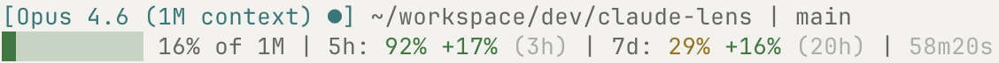

# Claude Lens

Are you burning through your Claude Code quota too fast? Or do you have more headroom than you think?

Other statuslines show how much you *used*. Claude Lens shows whether your *pace* is sustainable.



**Line 1** -- Model, context size, effort, project directory, git branch
**Line 2** -- Context bar, remaining quota with pace and reset countdown, session duration

Reading the numbers:

- **92%** remaining in the 5h window, **29%** remaining in the 7d window
- **+17%** green = you've used 17% less than expected at this point. Headroom. Keep going.
- **(3h)** = this window resets in 3 hours
- Colors: green (>30% left), yellow (11-30%), red (<=10%)

## Install

```bash
curl -o ~/.claude/statusline.sh \
  https://raw.githubusercontent.com/Astro-Han/claude-lens/main/claude-lens.sh

claude config set statusLine.command ~/.claude/statusline.sh
```

Restart Claude Code. That's it. Only dependency is `jq`.

To remove: `claude config set statusLine.command ""`

## Under the Hood

153 lines of Bash. Claude Code polls the statusline every ~300ms, so speed matters:

| Data | Source | Cache |
|------|--------|-------|
| Model, context, duration, cost | stdin JSON (single `jq` call) | None needed |
| Git branch + diff | `git` commands | `/tmp`, 5s TTL |
| Quota (5h, 7d, extra usage) | Anthropic Usage API | `/tmp`, 300s TTL, async background refresh |

Usage API calls happen in a background subshell -- the statusline never blocks waiting for the network.

## License

MIT
