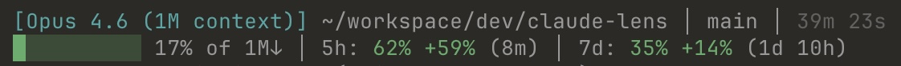

# Claude Lens

> Know if you're burning through your Claude Code quota too fast. Pure Bash + jq, ~33ms.



## Install

```bash
claude --plugin https://github.com/Astro-Han/claude-lens
```

Activate the statusline:

```bash
lens=$(find ~/.claude/plugins -name 'claude-lens.sh' -type f 2>/dev/null | head -1) && bash "$lens" --install
```

Restart Claude Code. Done. If `find` returns nothing, the plugin may not be installed yet.

To remove: replace `--install` with `--uninstall`.

## What You See

- **Pace tracking** - green +N% = headroom, red -N% = slow down
- Quota remaining (5h + 7d) with reset countdowns
- Context bar with trend arrows
- Git status, tools, subagents, todos

Zero config. One-line install.

## Configure

Edit `~/.config/claude-lens/config` (or `$CLAUDE_PLUGIN_DATA/config`):

```ini
# Preset: minimal | standard | full
PRESET=standard

# Module toggles (true/false)
SHOW_COST=false
SHOW_SPEED=true
SHOW_TREND=true
SHOW_USAGE=true
```

Changes take effect on the next statusline refresh (~300ms).

## vs claude-hud

[claude-hud](https://github.com/jarrodwatts/claude-hud) pioneered statusline monitoring for Claude Code. claude-lens matches its features and adds pace tracking, with a different architectural approach:

| | claude-hud | claude-lens |
|--|-----------|-------------|
| Runtime | Node.js | Bash + jq |
| Invocation | ~70ms | ~33ms |
| Transcript | Full scan O(n) - degrades over time | Incremental O(1) - constant |
| Caching | In-memory (lost on restart) | File-based (survives restarts) |
| Usage API | Blocks on cache miss | Async background refresh |

Features only in claude-lens: pace tracking, remaining % display, both 5h+7d reset countdowns, diff line stats, worktree paths.

## How It Works

Claude Code calls the statusline script every ~300ms. claude-lens uses layered caching to stay fast:

- **stdin JSON** - context, model, duration (direct, no I/O)
- **Git** - file cache, TTL 5s
- **Usage API** - file cache, TTL 300s, async background refresh (stale-while-revalidate)
- **Transcript** - byte-offset tracking, only reads new data since last call

## License

MIT
